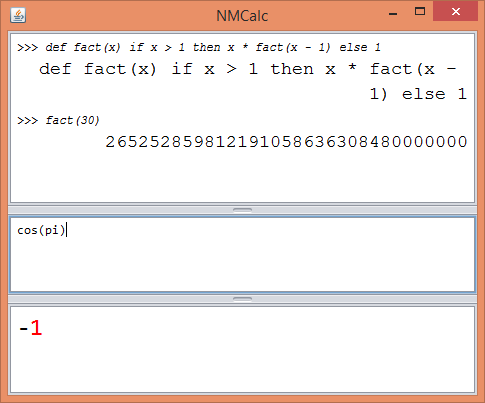

# NMCalc v0.2 
NMCalc is primarily a desktop calculator application.  It is very young project, but already has useful functions.

## Usage
The application window is divided into three parts (from top to bottom):
history window, input window and result window.  Enter an expression into
the input window (the middle one), the result is shown as you type in the
result window (the bottom one).  To commit the expression into the history
window, press `Ctrl + Enter`.

## Features

### Variables

The variable assignment syntax is simply:

    x = <expression>

Variables are remembered between different expression evaluations, can hold value of any type (real, list, boolean, function, etc.).

### Functions

There are some builtin functions, such as `sin(<real>)`, `apply(<value>, <arguments>)` or `eval(<expression>)`. Apart from those, users can define custom functions using the syntax:

    def myFunction(<arguments>) <expression>

For example, factorial would be defined as:

    def factorial(x) if x > 1 then x * factorial(x - 1) else 1

Function calls use a C-like syntax, for example: `factorial(5)`. Note - function definitions are themselfs expressions, which evaluate to the function itself (functions are first-class objects and as such can be assigned to variables, passed to function arguments or returned by a function).

### Pattern matching

The pattern matching syntax is:

    match <expression> {
      case <pattern 1> -> <expression>
      case <pattern 2> -> <expression>
      ...
    }

Example:

    def append(lst, value) match lst {
      case first :: rest -> first :: append(lst, value)
      case [] -> [value]
    }
    
    append([1, 2, 3], 4) => [1, 2, 3, 4]
